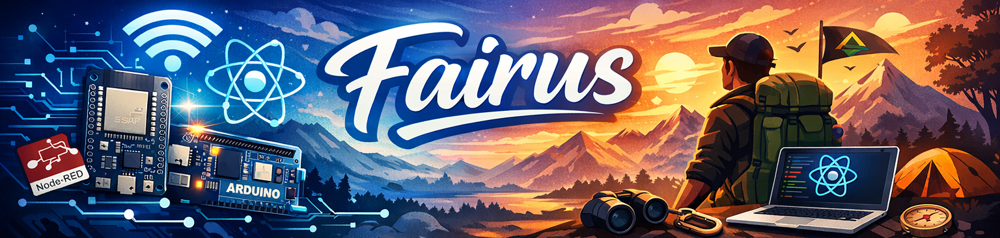

  

  

  
  
  

<h3 align="center">🚀 IoT Developer • Front-end Web Developer • Outdoor Enthusiast</h3>

---

## 👨‍💻 About Me
- 🎓 Computer System Student  
- 🤖 IoT Developer (ESP32 • Arduino • Node-RED)  
- 🌐 Frontend Web Developer  
- 🧗 Chairman of Mahapala Narotama Surabaya  
- 💡 Passionate about Automation & Smart Systems  

---

## 🛠️ Tech Stack

  

---

## ⏱️ Weekly Coding Stats
<!--START_SECTION:waka-->
<!--END_SECTION:waka-->

---

## 📊 GitHub Stats

  
  

  

---

## 📈 Activity Graph

---

## 🏆 Achievements

---

## 🔥 Featured Projects

| 🚀 Project | 📝 Description | 🔧 Stack |
|---|---|---|
| [NewsStreamHub](https://github.com/Fairus-24/NewsStreamHub) | Real-time categorized news with search & detail |    |
| [DigitalDesaHub](https://github.com/Fairus-24/DigitalDesaHub) | Dashboard digital desa interaktif |    |
| [ESP32 Telegram Bot](https://wokwi.com/projects/382081002120527873) | IoT alerts & control via Telegram |    |

<table>
  <tr>
    <td align="center">
      
    </td>
    <td align="center">
      
    </td>
    <td align="center">
      
    </td>
  </tr>
</table>

---

## 🐍 Contribution Snake

---

## 🎧 Recently Played Music

  

---

## 🌤️ Weather

  

---

## 💬 Dev Quote

  

---

## 📊 Full Metrics Dashboard

---

## 👀 Visitors

  

---

## 🤝 Connect With Me

  
  
  
  

---

<em>"The best way to predict the future is to invent it."</em>

